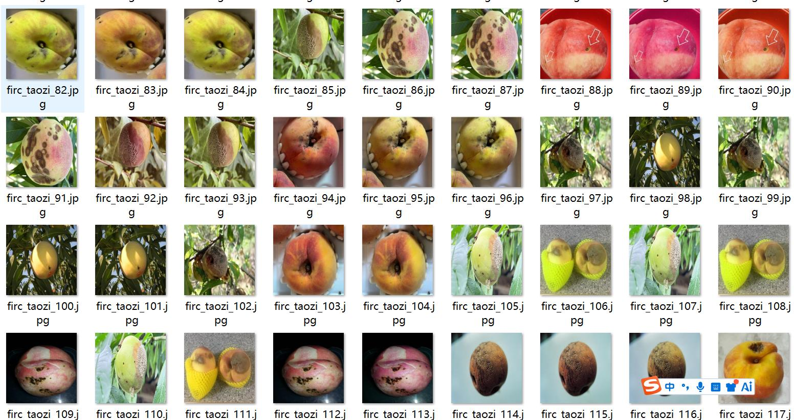
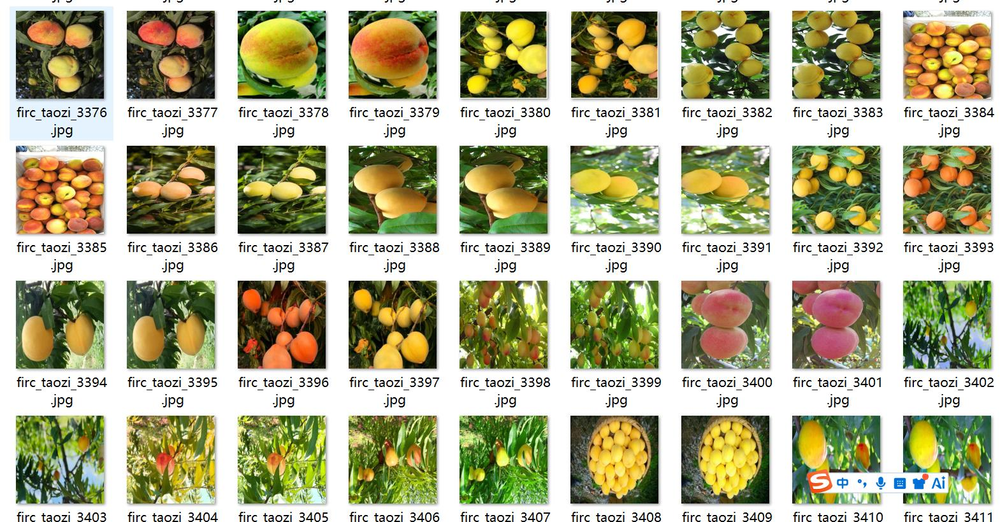
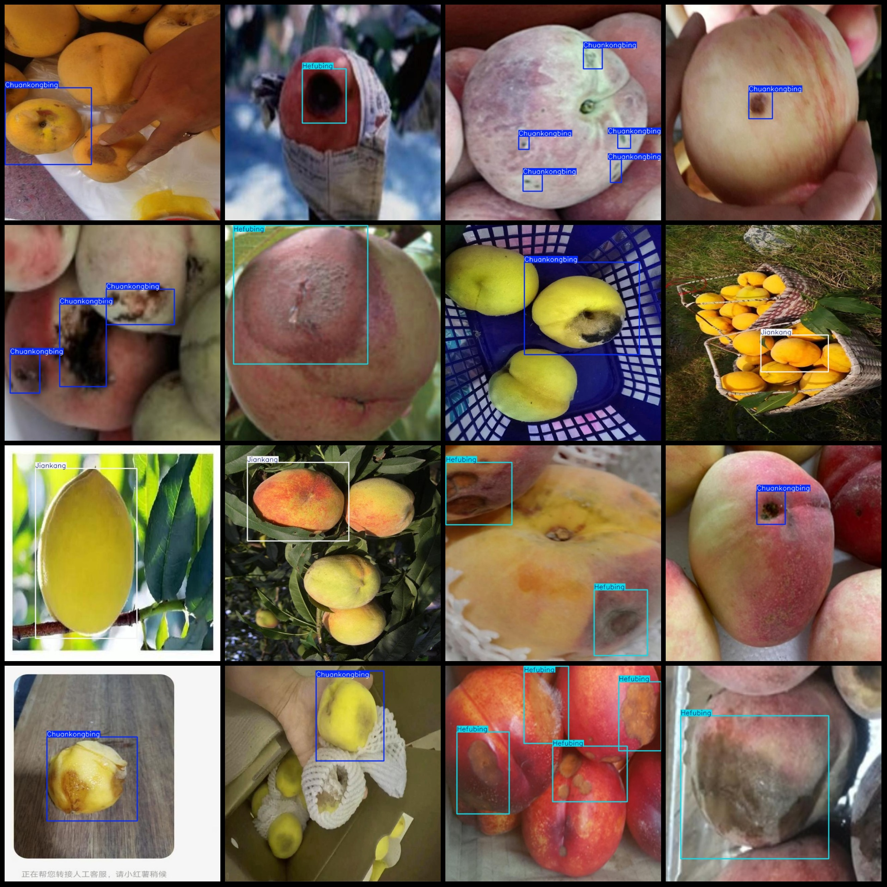
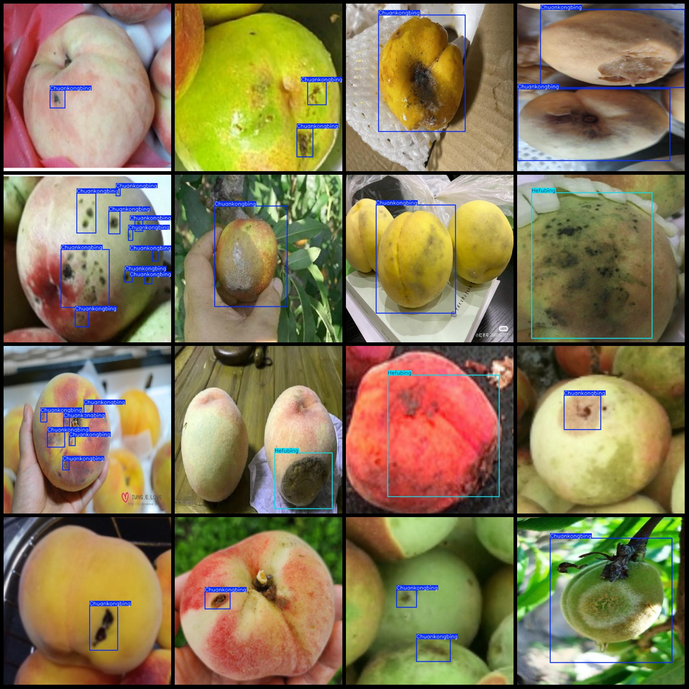

# Smart Orchard Peach Disease Detection Data Set: VOC+YOLO Format with 3914 Images and 3 Labels

The dataset format includes both Pascal VOC format and YOLO format (excluding the split path in the txt file, just containing jpg images along with their corresponding VOC format xml files and YOLO 
format txt files).

Number of images (jpg file count): 3914
Number of annotations (xml file count): 3914
Number of annotations (txt file count): 3914
Number of annotation categories: 3
Annotation category names according to the labels folder's classes.txt file (note that the order in the YOLO format is not consistent with this, but follows the labels folder's classes.txt): 
["Chuankongbing", "Hefubing", "Jiankang"]
Each category has a number of bounding boxes:
- Chuankongbing (Punch disease) bounding box count = 3285, occupying images = 2097
- Hefubing (Brown rot) bounding box count = 1418, occupying images = 1028
- Jiankang (Healthy) bounding box count = 1075, occupying images = 789
Total bounding box count: 5778
Image resolution: 640x640
Annotation tool used: labelImg
Annotation rules: drawing bounding boxes for each class
Important notice: The dataset does not have been divided into training, validation, or test sets; you will need to do so yourself.
Special declaration: This dataset does not guarantee the accuracy of the trained models or weight files.
Image previews:
Annotation examples:

## Images

Here is a pay link on Stripe ( https://buy.stripe.com/3cs8yP7sY87d0vu9AB ). Please contact me lonlonago@foxmail.com after funding $89, and I will send you a complete data files , thank you!

